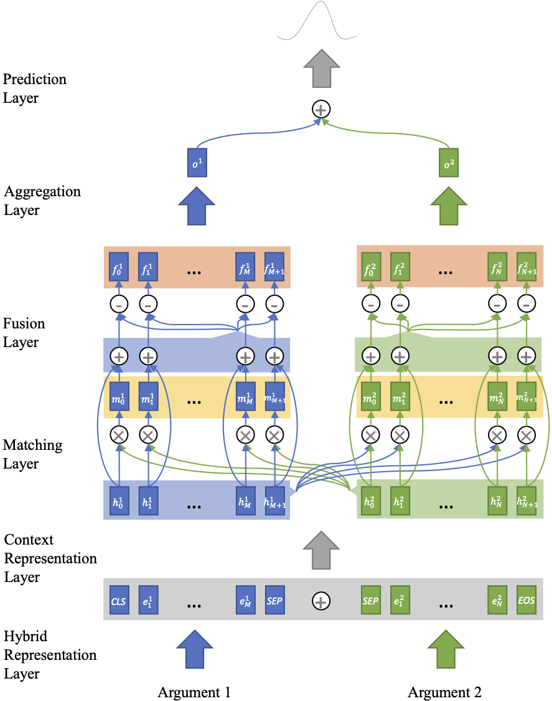
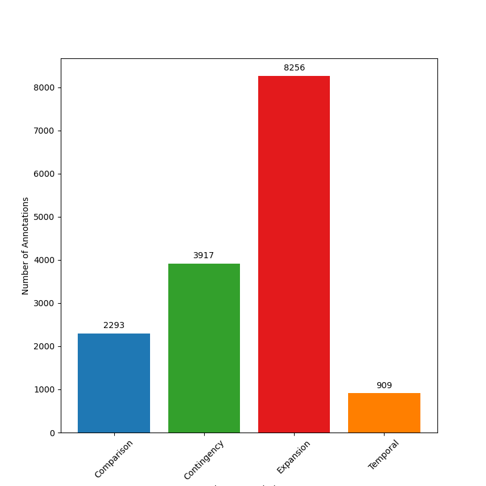
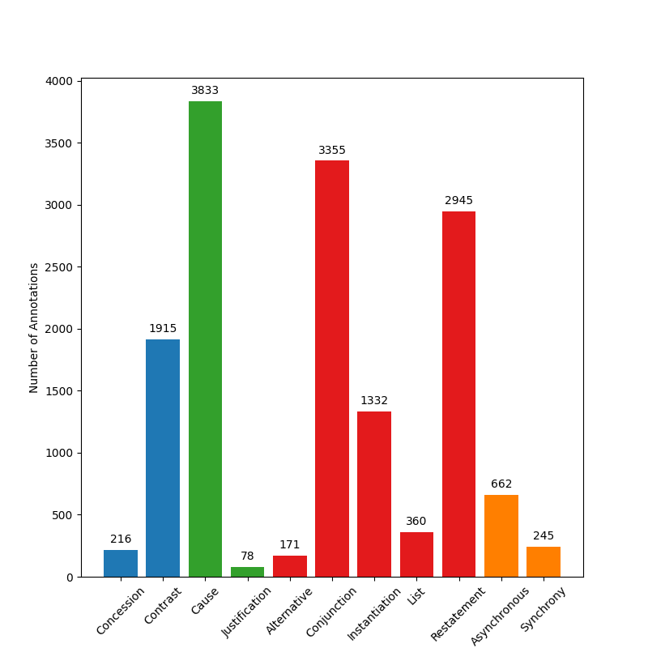
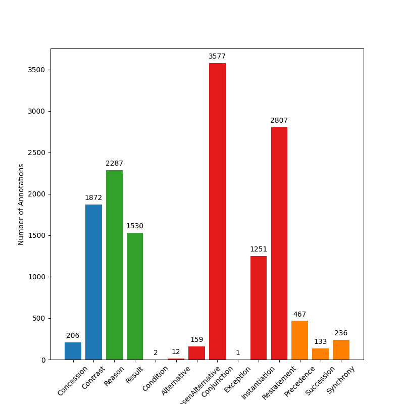
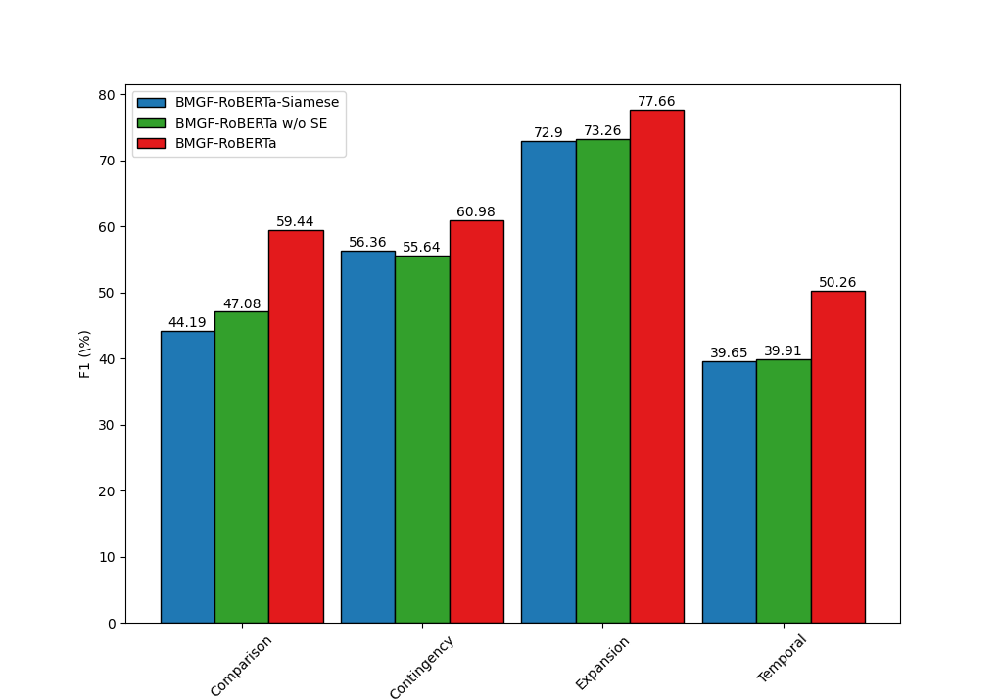

# BMGF-RoBERTa

This repository provides the BMGF-RoBERTa model, which is used in the implicit discourse relation classification. 

*Figure 1: Architecture*




## Data

We use PDTB 2.0 and CoNLL 2016 Shared Task to evaluate our models.
Due to the LDC policy, we cannot release the PDTB data and CoNLL test and blind data.
If you have bought data from LDC, please put the PDTB .csv file from [cgpotts/pdtb2](https://github.com/cgpotts/pdtb2) and CoNLL data in *data/pdtb* and *data/conll* respectively.

*Figure 2: PDTB 4-way categories*




*Figure 3: PDTB 11-way senses*




*Figure 4: CoNLL 15-way senses (EntRel is not included because it does not appear in implicit parts)*




## Results

| Model | PDTB-4 (F1) | PDTB-4 (Acc) | PDTB-11 (Acc) | CoNLL-Test (Acc) | CoNLL-Blind (Acc) |
| --- | --- | --- | --- | --- | --- |
| Previous SOTAs | 52.89 | 60.63 | 53.23| 40.91 | 40.12 |
| BMGF-RoBERTa-Siamese | 53.70 | 62.27 | 50.37 | 47.42 | 46.24 |
| BMGF-RoBERTa | **63.39** | **69.06** | **58.13** | **57.26** | **55.19** |

*Table 1: Performance of multi-class classification on PDTB and CoNLL-2016 in terms of accuracy (Acc) (%) and macro-averaged F1 (F1) (%).*

| Model | Comparison | Contingency | Expansion | Temporal |
| --- | --- | --- | --- | --- |
| Previous SOTAs | 47.85 | 58.96 | 72.47 | 45.61 | 
| BMGF-RoBERTa-Siamese | 44.19 | 56.36 | 72.90 | 39.65 | 
| BMGF-RoBERTa | **59.44** | **60.98** | **77.66** | **50.26** |

*Table 2: Performance of multiple binary classification on the top level classes in PDTB in terms of F1 (%).*

*Figure 5: Ablation Study*




### Package Dependencies

* tqdm
* numpy
* pandas
* scipy
* torch >= 1.3.0
* transformers >= 2.1.1

### Preprocessing

#### Penn Discourse Treebank 2.0

```bash
python preprocess_pdtb.py \
    --csv_file_path ../data/pdtb/pdtb2.csv \
    --types Implicit \
    --encoder roberta \
    --dataset_file_path ../data/pdtb/train_implicit_roberta.pt \
    --sections 2,3,4,5,6,7,8,9,10,11,12,13,14,15,16,17,18,19,20
python preprocess_pdtb.py \
    --csv_file_path ../data/pdtb/pdtb2.csv \
    --types Implicit \
    --encoder roberta \
    --dataset_file_path ../data/pdtb/valid_implicit_roberta.pt \
    --sections 0,1
python preprocess_pdtb.py \
    --csv_file_path ../data/pdtb/pdtb2.csv \
    --types Implicit \
    --encoder roberta \
    --dataset_file_path ../data/pdtb/test_implicit_roberta.pt \
    --sections 21,22
```

#### CoNLL 2016

```bash
python preprocess_conll.py \
    --json_file_path ../data/conll/2015-2016_conll_shared_task/data/conll16st-en-03-29-16-train/relations.json \
    --types Implicit \
    --encoder roberta \
    --dataset_file_path ../data/conll/train_implicit_roberta.pt
python preprocess_conll.py \
    --json_file_path ../data/conll/2015-2016_conll_shared_task/data/conll16st-en-03-29-16-dev/relations.json \
    --types Implicit \
    --encoder roberta \
    --dataset_file_path ../data/conll/valid_implicit_roberta.pt
python preprocess_conll.py \
    --json_file_path ../data/conll/2015-2016_conll_shared_task/data/conll16st-en-03-29-16-test/relations.json \
    --types Implicit \
    --encoder roberta \
    --dataset_file_path ../data/conll/test_implicit_roberta.pt
python preprocess_conll.py \
    --json_file_path ../data/conll/2015-2016_conll_shared_task/data/conll15st-en-03-29-16-blind-test/relations.json \
    --types Implicit \
    --encoder roberta \
    --dataset_file_path ../data/conll/blind_implicit_roberta.pt
```

### Training

You can train models in different settings, including 4-way or 11-way classfications on PDTB or the binary classification for each relation.
For the multi-label classification, please use the *train.py*; for the binary classification, please use *train_binary.py*.

To train a 4-way BMGF-RoBERTa, just set the *num_rels* as **four**, *encoder* as **roberta**, and *finetune* as **type**.
```bash
python train.py \
    --train_dataset_path ../data/pdtb/train_implicit_roberta.pt \
    --valid_dataset_path ../data/pdtb/valid_implicit_roberta.pt \
    --test_dataset_path ../data/pdtb/test_implicit_roberta.pt \
    --save_model_dir ../data/dumps \
    --num_rels 4 \
    --gpu_ids 0,1 \
    --batch_size 32 \
    --lr 0.001 \
    --weight_decay 0.0005 \
    --max_grad_norm 2.0 \
    --loss ce \
    --encoder roberta \
    --finetune type \
    --hidden_dim 128 \
    --num_perspectives 16 \
    --num_filters 64 \
    --activation leaky_relu \
    --dropout 0.2
```

### Evaluation

Macro-F1 and accuracy are used in discourse relation classification. Some instances were annotated as more than one label. Following previous work and the scorer at [conll16st](https://github.com/attapol/conll16st), a prediction is regarded as correct once it matches one of the ground-truth labels.
You can check functions in *evaluate.py*.

### Baselines

* For the BMGF-RoBERTa-Siamese model, just call *Encoder.forward_single(x, mask)* instead of *Encoder.forward_pair(x1, x2, mask1, mask2)*
* For BMGF-RoBERTa w/o SE, set *--finetune none* instead of *--finetune type*
* For BMGF-RoBERTa w/o GF/BM, delete these layers from *BMGFModel* in the *model.py* file

### Checkpoint (remember to call `.set_finetune()` or `.eval()`)

* CoNLL model ([onedrive](https://hkustconnect-my.sharepoint.com/:u:/g/personal/xliucr_connect_ust_hk/EY1RvhZCqaBFkzmcvqDfC3ABkRGjnsTahNTgu8O_jX1ajg?e=1fEbw0))

## Reference:
The details of this architecture are described in the following paper. If you use this model in your work, please kindly cite it.

```bibtex
@inproceedings{LiuOSJ20,
  author    = {Xin Liu and
               Jiefu Ou and
               Yangqiu Song and
               Xin Jiang},
  title     = {On the Importance of Word and Sentence Representation Learning in
               Implicit Discourse Relation Classification},
  booktitle = {Proceedings of the Twenty-Ninth International Joint Conference on
               Artificial Intelligence, {IJCAI} 2020},
  pages     = {3830--3836},
  year      = {2020},
}
```
